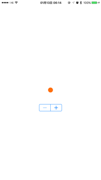

# BadgeView

Customizable UIKit badge view, it is used in our app to show new messages, the code is rather simple to satisfy our own need, but you can easily customize to fit your own need.

## Key Feature
1. [x] AutoLayout with customizable intrinsicContentSize.
2. [x] Customizable properties with @IBInspectable and @IBDesignable support..

## Usage

1. Drag `BadgeView.swift` to your project
2. Customize the properties in Storyboard or in code
3. Set the `value` property of BadgeView
